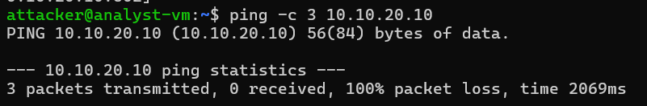
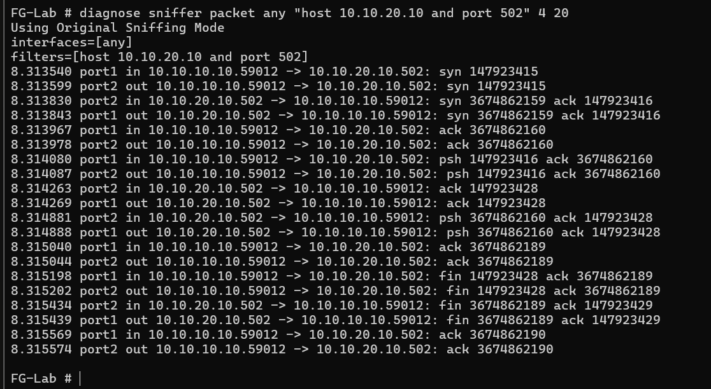
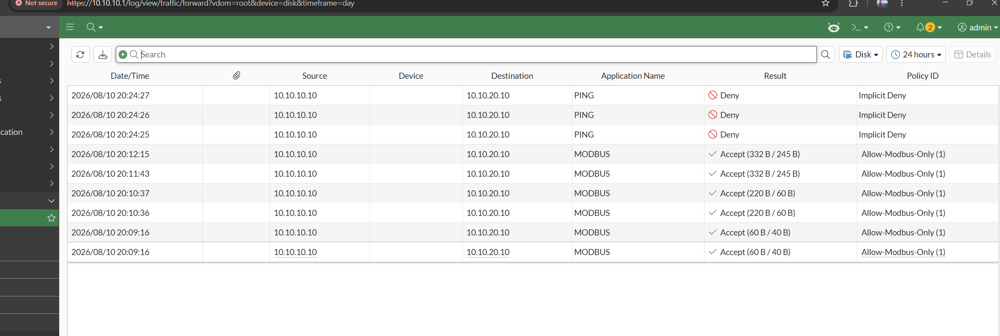

# Phase 1 — Network Segmentation & Firewall Policy Configuration

## Overview

This phase establishes and validates IT/OT network segmentation using a FortiGate VM 
as the enforcement point between an analyst/attacker segment and an OT target segment, 
with a firewall policy restricting inter-segment traffic to Modbus (TCP/502) only.

## Architecture

```
[analyst-vm] ---- [FortiGate port1: 10.10.10.1/24] --- FortiGate --- [FortiGate port2: 10.10.20.1/24] ---- [conpot-vm]
 10.10.10.10              "IT segment" (VMnet1)                          "OT segment" (VMnet2)              10.10.20.10
```

Two isolated VMware Host-only networks (VMnet1, VMnet2) provide the segment boundaries, 
with static addressing throughout (DHCP disabled) to keep the topology predictable and 
match the project's documented IP scheme.

| Device | Segment | IP |
|---|---|---|
| FortiGate port1 | 10.10.10.0/24 | 10.10.10.1 |
| analyst-vm | 10.10.10.0/24 | 10.10.10.10 |
| FortiGate port2 | 10.10.20.0/24 | 10.10.20.1 |
| conpot-vm | 10.10.20.0/24 | 10.10.20.10 |

The OT target is a minimal Modbus TCP server built on `pymodbus` rather than the 
originally-planned conpot honeypot (see Troubleshooting Log, Phase 0, for the 
dependency-compatibility rationale behind that substitution).

## Firewall Policy

A single explicit policy governs IT→OT traffic, backed by a custom service object 
restricting the allowed port to Modbus's standard TCP/502:

```
config firewall service custom
    edit "MODBUS"
        set tcp-portrange 502
    next
end

config firewall policy
    edit 1
        set name "Allow-Modbus-Only"
        set srcintf port1
        set dstintf port2
        set srcaddr all
        set dstaddr all
        set action accept
        set schedule always
        set service "MODBUS"
        set logtraffic all
    next
end
```

No corresponding OT→IT policy was configured; FortiGate's stateful inspection permits 
return traffic for connections initiated from the IT side without requiring a mirrored 
rule. Implicit-deny logging was also enabled (`config log setting / set 
fwpolicy-implicit-log enable`) so that traffic blocked by the default deny — not just 
traffic explicitly allowed — is visible in Forward Traffic logs.

## Validation

Three tests establish that the segmentation boundary enforces protocol-level precision 
rather than a simple segment-wide allow/deny:

**1. Pre-policy baseline (implicit deny).** Before any policy existed, cross-segment 
traffic was tested to confirm FortiGate's default-deny behavior:

```
ping -c 3 10.10.20.10
3 packets transmitted, 0 received, 100% packet loss
```



**2. Post-policy Modbus traffic (allowed).** With the policy in place, a live Modbus 
read was issued from analyst-vm:

```python
from pymodbus.client import ModbusTcpClient
c = ModbusTcpClient('10.10.20.10')
c.connect()
print(c.read_holding_registers(0, count=10))
c.close()
```

Result: `ReadHoldingRegistersResponse(...)` returned successfully. A concurrent packet 
capture on FortiGate (`diagnose sniffer packet any "host 10.10.20.10 and port 502" 4 
20`) shows a complete, clean exchange — TCP three-way handshake, Modbus request/response 
(psh/ack pairs), and a clean four-way connection close — confirming the traffic 
traverses the firewall as designed rather than being incidentally permitted.



**3. Post-policy non-Modbus traffic (still denied).** With the same policy active, 
ICMP was re-tested and remained fully blocked:

```
ping -c 3 10.10.20.10
3 packets transmitted, 0 received, 100% packet loss
```

**4. Log evidence.** FortiGate's Forward Traffic log shows both outcomes side by side 
for the same source/destination pair, differentiated only by protocol:

| Date/Time | Source | Destination | Application | Result | Policy |
|---|---|---|---|---|---|
| 2026/08/10 20:24:2x | 10.10.10.10 | 10.10.20.10 | PING | Deny | Implicit Deny |
| 2026/08/10 20:1x:xx | 10.10.10.10 | 10.10.20.10 | MODBUS | Accept | Allow-Modbus-Only (1) |



Together, these results confirm the policy enforces access at the protocol level — 
the OT segment is reachable only via Modbus, with all other traffic (including basic 
ICMP reachability checks) denied by default.

## Limitations

- Only a single application-layer protocol (Modbus) was tested against the policy; 
  no attempt was made to validate behavior against protocol spoofing on a non-standard 
  port, which FortiGate's service-object matching (port-based, not deep packet 
  inspection by default) would not catch without an additional application-control 
  profile.
- The lab network is fully air-gapped by design (no route to the internet from either 
  segment), which is representative of many OT environments but also means NTP-based 
  time sync and FortiGuard threat intelligence updates are unavailable — acceptable 
  for this lab's scope, but a real deployment would need an explicit, tightly 
  controlled path for these services.
 
