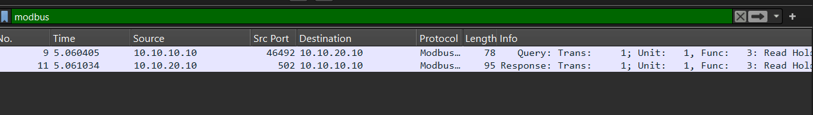
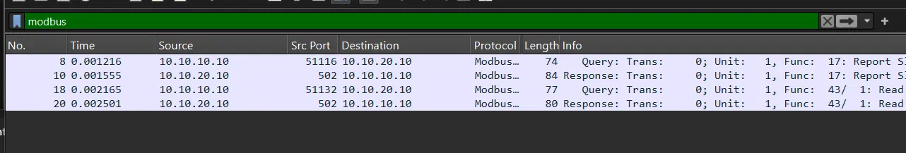
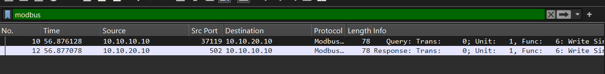

# Phase 2 — OT Protocol Traffic Generation & Analysis

## Overview

This phase generates three distinct traffic types against the Modbus target 
(conpot-vm, 10.10.20.10) established in Phase 1, captures each in isolation, and 
compares them at the Modbus function-code level to identify a detection signal.

## Traffic Generated

| Type | Tool | Command |
|---|---|---|
| Legitimate read | pymodbus client | `read_holding_registers(0, count=10)` |
| Reconnaissance | nmap NSE | `nmap -p 502 --script modbus-discover -Pn 10.10.20.10` |
| Unauthorized write | Metasploit `auxiliary/scanner/scada/modbusclient` | `ACTION WRITE_REGISTER`, `DATA 1234`, `DATA_ADDRESS 0` |

Each was captured independently on analyst-vm (`tcpdump -i ens33 -w <file>.pcap host 
10.10.20.10 and port 502`) and analyzed in Wireshark with a `modbus` display filter.

## Findings

| Traffic | Function Code | Meaning |
|---|---|---|
| Legitimate read | **3** | Read Holding Registers |
| nmap reconnaissance | **17**, **43/1** | Report Slave ID / Read Device Identification |
| Metasploit write | **6** | Write Single Register |

The three traffic types are fully separable on function code alone — no payload 
inspection or timing analysis required.

*Baseline: pymodbus read_holding_registers, captured in Wireshark.*

*nmap modbus-discover NSE script: device identity queries, not process data reads.*

*auxiliary/scanner/scada/modbusclient, WRITE_REGISTER action.*

**Write verified independently:** rather than trusting Metasploit's own success 
message, the register was re-read via a separate legitimate pymodbus client 
post-write and confirmed changed (`registers=[1234]`).

## Indicators

**1. Device identity query function codes (17, 43/1)**
Legitimate runtime polling reads/writes process data; it has no operational reason 
to query device identity after commissioning. Presence of these codes is a strong 
reconnaissance signal.
*False positive case:* a one-time inventory/commissioning check would also trigger 
this — frequency context helps distinguish from repeated scanning.

**2. Write function codes (6) from a source with no prior write baseline**
Func 6 is a valid, documented operation — the anomaly is contextual, not intrinsic. 
A source that has only ever read, suddenly writing, is the signal; a legitimate HMI 
with an established write pattern would not trigger this the same way.
*Limitation:* not generalizable without an allowlist of known-legitimate write 
sources outside this lab.

**3. Connection volume/pattern (deferred)**
Not directly captured this session — both scans here were single, short-lived 
sessions, so no volume signal appeared in the data. Revisit in Phase 3 if time 
permits (multiple scan passes needed to actually observe this rather than assert it).

## Known Non-Signal

A single failed-then-retried TCP connection to port 502 is a known benign 
environment quirk (see Troubleshooting Log, Phase 2) — not a reconnaissance pattern. 
Excluded from detection logic to avoid false positives in Phase 3.

## Next

Phase 3 — translate these indicators into Splunk detection rules.
